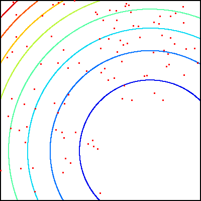
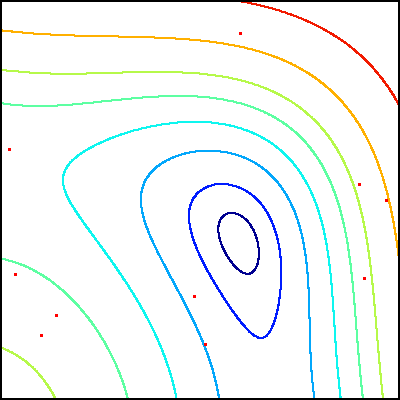

BFOA
====

Bacterial Foraging Optimization Algorithm in C

| Tumble and swim steps of single bacterium | Swarm size controlled by attractant/repellant width |
| :---: | :---: |
|                 |                 |

| Chemotactic/reproduction/dispersal steps | Formation of mutiple swarms and their competition |
| :---: | :---: |
|                 |                 |